# Maker Robotics and Machine Learning with the Arduino Portenta and Shields


Started Jun 23rd, 2021

By: Jeremy Ellis, Technology Teacher, BC, Canada

###### Use at your own risk!

### Hopefully this will be ready for my students in February 2022


# This course is for Makers, not soon to be Engineers! 
Why, because I teach things as simply as possible but not necessarily the correct way. (Although soon to be Engineers are welcome to blast through the course. Seriously, these capable pre-engineering students have sometimes finished my semester long course in under 2 weeks!)

### I use the $ 103.40 USD Arduino Pro [PortentaH7](https://store.arduino.cc/usa/portenta-h7) Dual Core Micro-Controller with the $45.99 USD [Breakout Board](https://store.arduino.cc/usa/portenta-breakout) and $63.00 USD [LoRa Vision Shield](https://store.arduino.cc/usa/portenta-vision-shield-lora)  and/or $47.15 USD [Ethernet Vision Shield](https://store.arduino.cc/usa/portenta-vision-shield), possibly more shields later.

<br>

Yes they are expensive, ask any teacher (music, shop, sewing, science) why they don't purchase cheap equipment. See other boards below for cheaper, not as good, options. When your Administrator says "Why don't you get the $4 RPI Pico", have an answer ready.

[Course:](#course)  

[Course Description:](#course-description)

[Pre-Understanding:](#pre-understanding) 

[Basic Costs:](#basic-costs)

[Platforms:](#platforms) 

[Other Boards:](#other-boards) 

[Other Languages:](#other-Languages) 

[Post Understanding Activities:](#post-understanding-activites)  

[Course Notes](#course-notes)
 


## Course:

Reminder all code examples are in the [Portenta Pro Community Solutions Library](https://github.com/hpssjellis/portenta-pro-community-solutions) that can be installed onto the Arduino IDE. The examples are [here](https://github.com/hpssjellis/portenta-pro-community-solutions/tree/main/examples). My original Portenta Research github is [here](https://github.com/hpssjellis/my-examples-for-the-arduino-portentaH7)

Note: To edit this table use [https://www.tablesgenerator.com/markdown_tables](https://www.tablesgenerator.com/markdown_tables) File-->Paste Table Data --> Generate --> Copy to Clipboard--> paste back here


<a id="cool" > cool </a> 


### not


<a href="#-">`^`</a> - (click to go to first anchor of this comment)


| Topic                          | Example Code                                                                                                                                                                 | Youtube Video | Resource Link 1 | Setup Image | To Do |
|--------------------------------|------------------------------------------------------------------------------------------------------------------------------------------------------------------------------|---------------|-----------------|--------|--------|
| <a href="#1">`1`.</a>  Auto Blink and Serial Print  | [a-a-hello-blink.ino](https://github.com/hpssjellis/portenta-pro-community-solutions/blob/main/examples/a-portentaH7-examples/a-a-hello-blink/a-a-hello-blink.ino) |      [](https://www.youtube.com/watch?v=3E5KUT115xY&list=PL57Dnr1H_egv1FVzAcCZVeANJMs3Hta05&index=7)         |                 |   n/a     |    Print other things and change the pattern of blinking using different colors LEDR, LEDG, LEDB, LED_BUILTIN (which is green). Note: I stay away from LEDR as red is used to show errors    |
| <a name="2"></a>  2. Button cause blink          |       [b-b-h-button-control-led](https://github.com/hpssjellis/portenta-pro-community-solutions/blob/main/examples/b-portenta-h7-with-accessories/b-b-actuators/b-b-h-button-control-led/b-b-h-button-control-led.ino)                                                                                                                                                                     |    [](https://www.youtube.com/watch?v=cwIpqYYkWFA&list=PL57Dnr1H_egv1FVzAcCZVeANJMs3Hta05&index=6)           |                 |  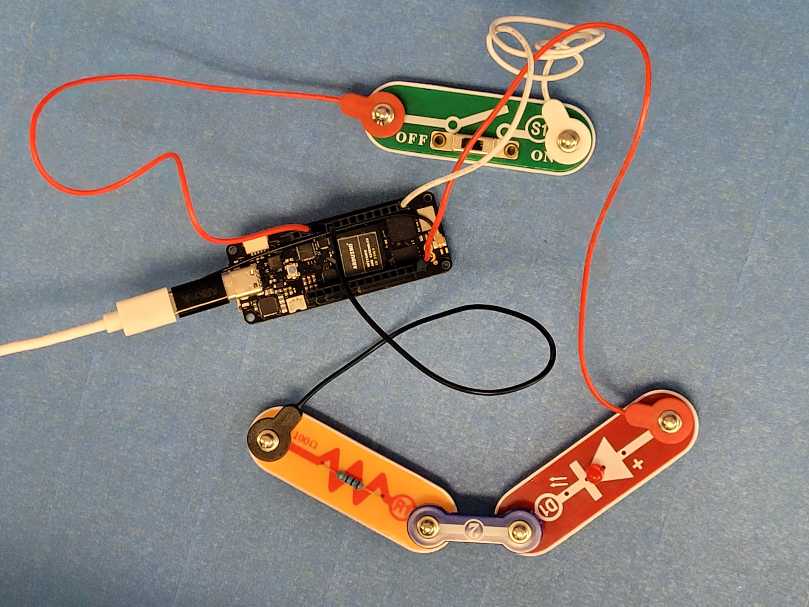       |   Control the LED with the button, then control multiple LED's with Multiple Buttons. Note: Can't control large current flow devices, WHY? Could you make the external LED interact like the internal LED?    |
| <a name="3"></a>  3. Analog Read (Voltage divider for various 2 prong sensors (variable resistors: flex sensor, photoresistor, touch/pressure sensor))                |  [b-a-a-any-variable-resistor-sensor.ino](https://github.com/hpssjellis/portenta-pro-community-solutions/blob/main/examples/b-portenta-h7-with-accessories/b-a-sensors/b-a-a-any-variable-resistor-sensor/b-a-a-any-variable-resistor-sensor.ino)                                                                                                                                                                            |               |                 |        |   Change the Resistor amount and which resistor is attached to 3V3 to get the largest most sensible range of readings.     |
| <a name="4"></a>  4. DAC to ADC                         |       [a-j-DAC-to-ADC.ino](https://github.com/hpssjellis/portenta-pro-community-solutions/blob/main/examples/a-portentaH7-examples/a-j-DAC-to-ADC/a-j-DAC-to-ADC.ino)                                                                                                                                                                       |               |                 |        |   Estimate the Voltage that the digital pin converts from 0 to 1, it should be close to half of 3V3     |
| <a name="5"></a>  5.  Flash SOS                           |     [g-a-SOS.ino](https://github.com/hpssjellis/portenta-pro-community-solutions/blob/main/examples/g-robotics-curriculum/g-a-SOS/g-a-SOS.ino)                                                                                                                                                                         |               |                 |        |   Get the code running to flash the LED_BUILTIN, then have it flash an SOS. 3 short flashes, 3 long flashes, 3 short flashes then a 5 second rest.     |
| <a name="6"></a>  6. Web WiFi   (need router acces to make global)                         |   [a-h-wifi-webserver.ino](https://github.com/hpssjellis/portenta-pro-community-solutions/blob/main/examples/a-portentaH7-examples/a-h-wifi-webserver/a-h-wifi-webserver.ino)                                                                                                                                                                           |               |                 |        |    Several layers to this project. Often easier to use your cell phone as a hot spot as school WiFi often has layers of security. I will still need to work with my School IT department to A. get the WiFi working and B. get an outside port. Probably wont happen. Change the buttons on the webpage to control some Actuator other than an LED    |
| <a name="7"></a>  7.  Servo                           |      [b-b-a-servo.ino](https://github.com/hpssjellis/portenta-pro-community-solutions/blob/main/examples/b-portenta-h7-with-accessories/b-b-actuators/b-b-a-servo/b-b-a-servo.ino)                                                                                                                                                                        |               |                 |        | MUST HAVE AN EXTERIOR BATTERY TO RUN THE 6 VOLT SERVO!  I have the Pololu Servo Product number 1057, Power HD High-Torque Servo 1501MG [here](https://www.pololu.com/product/1057).  <br> To connect Portenta D5 (orange wire) GND (brown wire) to servo, <br> 6 volt battery positive (red) and Negative (brown) to servo.   |
| <a name="8"></a>  8. Transistor                            |      [b-b-d-pwm-transistor.ino](https://github.com/hpssjellis/portenta-pro-community-solutions/blob/main/examples/b-portenta-h7-with-accessories/b-b-actuators/b-b-d-pwm-transistor/b-b-d-pwm-transistor.ino)                                                                                                                                                                        |               |                 |        |        |
| <a name="9"></a>  9. Small Dual DC Motor Driver                            |       [b-b-f-small-dual-dc-motor-driver.ino](https://github.com/hpssjellis/portenta-pro-community-solutions/blob/main/examples/b-portenta-h7-with-accessories/b-b-actuators/b-b-f-small-dual-dc-motor-driver/b-b-f-small-dual-dc-motor-driver.ino)                                                                                                                                                                       |               |                 |  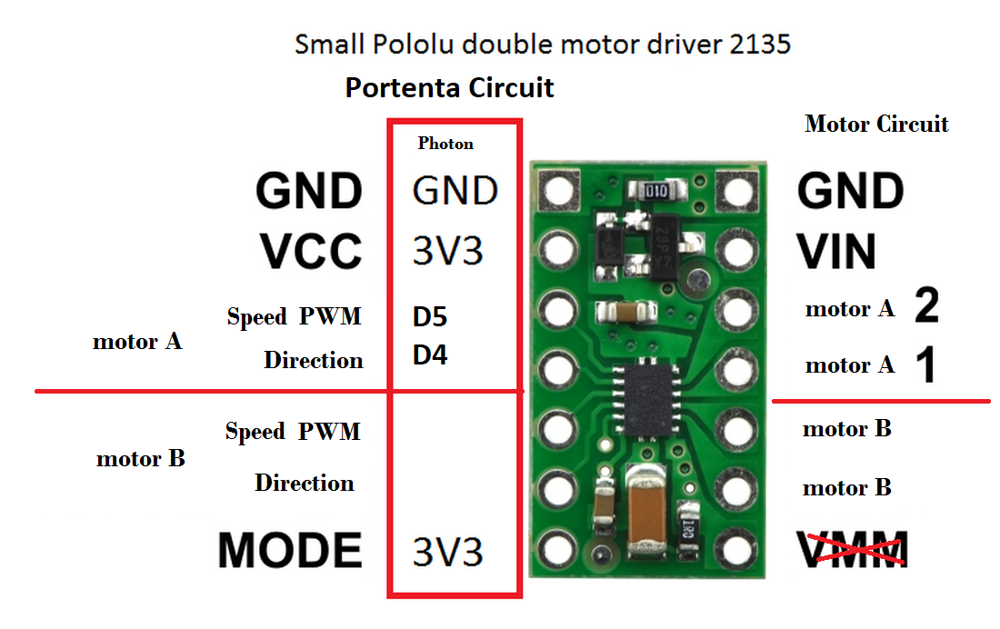      |  Get a small motor working using it's own power supply and change the code so it does what you want. Pololu #2135 DRV8835 Dual Motor Driver Carrier  [here](https://www.pololu.com/product/2135)     |
| <a name="10"></a>  10.  Large DC Motor Driver                          |     [b-b-g-big-dc-motor-driver.ino](https://github.com/hpssjellis/portenta-pro-community-solutions/blob/main/examples/b-portenta-h7-with-accessories/b-b-actuators/b-b-g-big-dc-motor-driver/b-b-g-big-dc-motor-driver.ino)                                                                                                                                                                         |               |                 |   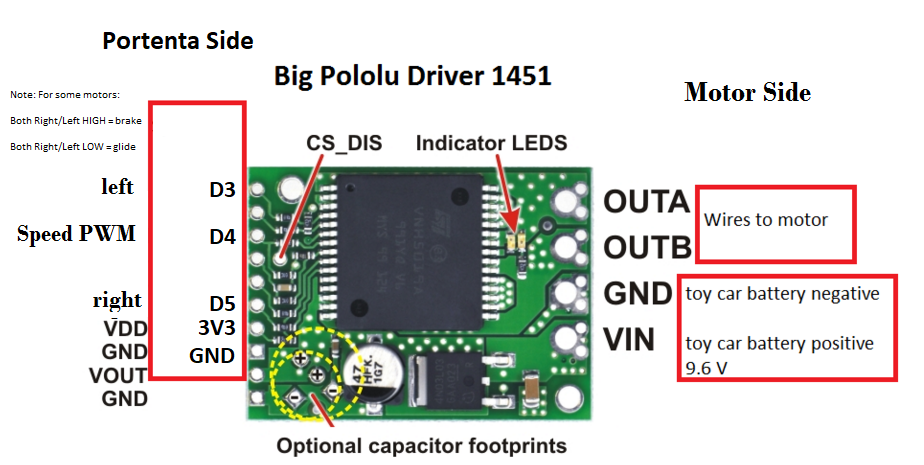      |   Get a 6V motor running and change code for it to do what you want. Protect the Phton from the 6 Volt motor side. Check Pololu 1451 VNH5019 Motor Driver Carrier [here](https://www.pololu.com/product/1451)     |
| <a name="11"></a>  11.  Stepper Motor                         |           [b-b-e-stepper-motor.ino](https://github.com/hpssjellis/portenta-pro-community-solutions/blob/main/examples/b-portenta-h7-with-accessories/b-b-actuators/b-b-e-stepper-motor/b-b-e-stepper-motor.ino)                                                                                                                                                                   |               |                 |     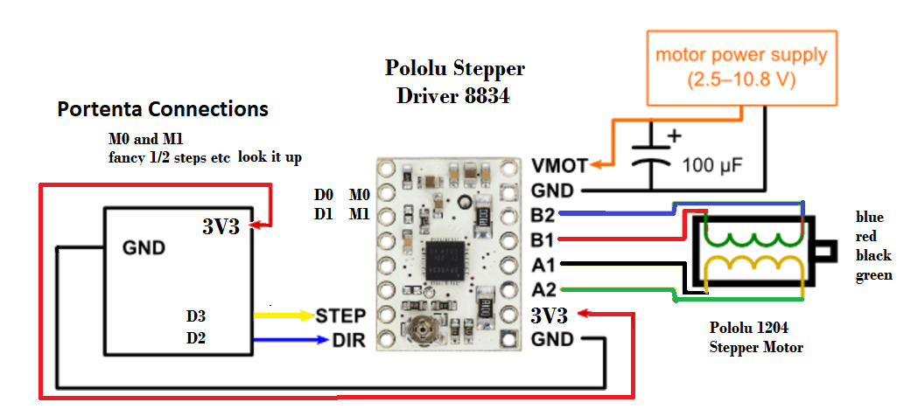       |   Note: This stepper needs 6V, Change code to do what you want.  Pololu 2134 DRV8834 Low-Voltage Stepper Motor Driver Carrier [here](https://www.pololu.com/product/2134)   |
| <a name="12"></a>  12.  Serial I2C OLED                          |          [b-b-b-I2C-grove-OLED.ino](https://github.com/hpssjellis/portenta-pro-community-solutions/blob/main/examples/b-portenta-h7-with-accessories/b-b-actuators/b-b-b-I2C-grove-OLED/b-b-b-I2C-grove-OLED.ino)                                                                                                                                                                    |               |                 |   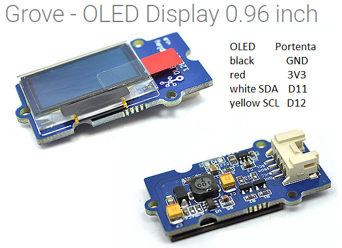      |   Have fun with this. Have it say what you want, where you want it and for how long.     |
| <a name="13"></a>  13.  Serial SPI Pixy2                          |           [b-a-b-pixy2-SPI.ino](https://github.com/hpssjellis/portenta-pro-community-solutions/blob/main/examples/b-portenta-h7-with-accessories/b-a-sensors/b-a-b-pixy2-SPI/b-a-b-pixy2-SPI.ino)                                                                                                                                                                   |               |                 |        |        |
| <a name="14"></a>  14. Serial UART FingerPrintScanner-FPS (Not Yet Working)                         |                                                                               
| <a name="15"></a>  15. GPS (Not Yet Working)                           |                                                                                                                                                                             |               |                 |        |        |
| <a name="16"></a>  16. Acclerometer (Not Yet Working)                          |                                                                                                                                                                             |               |                 |        |        |
| <a name="17"></a>  17. FSLP-Touch  (Not Yet Working)                         |                                                                                                                                                                              |               |                 |        |        |
| <a name="18"></a>  18. Range-Finder  (Not Yet Working)                         |                                                                                                                                                                              |               |                 |        |        |
| <a name="19"></a>  19. Serial-putty                           |                                                                                                                                                                              |               |                 |        |        |
| <a name="20"></a> 20. Web-IFTTT   (Not Yet Working)                       |                                                                                                                                                                              |               |                 |        |        |
| <a name="21"></a>  21. Ethernet-Vision-Shield  (need router acces to make global)                         |                                                                                                                                                                              |               |                 |        |   Same as WiFi  might be difficult to get an outside line. While on the same local network things should work great. At home will have to configure your router to allow outside access. At school good luck.   |
| <a name="22"></a>  22. SD-card-Vision-Shield                          |                                                                                                                                                                              |               |                 |        |        |
| <a name="23"></a>  23. Microphone-Vision-Shield                          |                                                                                                                                                                              |               |                 |        |        |
| <a name="24"></a>  24. Camera-Vision-Shield                           |                                                                                                                                                                              |               |                 |        |        |
| <a name="25"></a>  25. Rocksetta-Machine-Learning-Sine-Wave                           |        [e-b-a-rocksetta-hello-ml-sine.ino](https://github.com/hpssjellis/portenta-pro-community-solutions/blob/main/examples/e-portenta-machine-learning/e-b-portenta-rocksetta-ml/e-b-a-rocksetta-hello-ml-sine/e-b-a-rocksetta-hello-ml-sine.ino)                                                                                                                                                                      |               |                 |        |        |
| <a name="26"></a>  26. Edge-Impulse-Sound-Yes-No                          |                                                                                                                                                                              |               |                 |        |        |
| <a name="27"></a>  27. Edge-Impulse-Vision-Brush-Tube                          |                                                                                                                                                                              |               |                 |        |        |
| <a name="28"></a>  28. LoRaWan-Helium/TTN                           |     [c-b-b-helium-cayenne-us915.ino](https://github.com/hpssjellis/portenta-pro-community-solutions/blob/main/examples/c-portenta-vision-shields/c-b-lorawan-specific/c-b-b-helium-cayenne-us915/c-b-b-helium-cayenne-us915.ino)                                                                                                                                                                         |               |                 |        |    Setup a LoRaWan connection on the US915 Helium network and send random "fake" temperature data. <br><br>Need to setup the Helium side: https://console.helium.com/ for what it does with the data. I use the https://io.adafruit.com/ MQTT with Cayenne encoding, but lots of other options out there.  <br>Check the helium explorer for your area https://explorer.helium.com/   |
| <a name="29"></a>  29. Touch Screen (Not Yet Working)                          |                                                                                                                                                                              |           |                 |        |        |
| <a name="30"></a>  30.                            |                                                                                                                                                                              |           |                 |        |        |
| <a name="31"></a>  31.                            |                                                                                                                                                                              |           |                 |        |        |

### Advances topics if time permits (or you want to be an Engineer)


| Advanced Topic                          | Example Code                                                                                                                                                                 | Youtube Video | Resource Link 1 | Setup Image | To Do |
|--------------------------------|------------------------------------------------------------------------------------------------------------------------------------------------------------------------------|---------------|-----------------|--------|--------|
| <a name="advanced0"></a>  0.  Dual Core Programming                         |                                                                                                                                                                              |               |                 |        |        |
| <a name="advanced1"></a> 1.  [WebSocket-Gitpod](https://github.com/hpssjellis/Particle-Spark-Core-Photon-Websocket-Hack)   (Not Yet Fully Working)                       |                                                                                                                                                                              |               |                 |        |        |
| <a name="advanced2"></a>  2. [Local-cpp-Compile-Gitpod](https://github.com/hpssjellis/my-gitpod-of-edge-impulse)  (Not Yet Fully Working)                         |                                                                                                                                                                              |               |                 |        |        |
| <a name="advanced3"></a>  3. LoRa using [GrumpOldPizza](https://github.com/GrumpyOldPizza/ArduinoCore-stm32l0)-Tlera-board                         |                                                                                                                                                                              |               |                 |        |        |
| <a name="advanced4"></a>  4. MQTT server (Not Yet Working)                      |                                                                                                                                                                              |               |                 |        |        |
| <a name="advanced5"></a>  5.  SerialtTransfer with Breakout Board                        |                                                                                                                                                                              |               |                 |        |        |
| <a name="advanced6"></a>  6.  ArduinoJSON with Breakout Board                        |                                                                                                                                                                              |               |                 |        |        |
| <a name="advanced7"></a>  7.                          |                                                                                                                                                                              |               |                 |        |        |
| <a name="advanced8"></a>  8.                          |                                                                                                                                                                              |               |                 |        |        |
| <a name="advanced9"></a>  9.                          |                                                                                                                                                                              |               |                 |        |        |
| <a name="advanced10"></a>  10.                          |                                                                                                                                                                              |               |                 |        |        |


## Course Description:

### First Year:

Circuit basics, Micro-controller basics (LED's buttons, wiring, breadboards), Platforms, Languages, simple sensors and actuators(screens/motors:DC, Servo, Stepper), connectors: I2C, SPI, Uart/Serial, connecting:WiFi, BLE, Ethernet, LoRaWan ([Helium](https://explorer.helium.com/coverag), [TTN The Things Network](https://www.thethingsnetwork.org/map), [Adafruit.io](https://io.adafruit.com/), [ArduinoCreate](https://www.arduino.cc/en/main/create)), possibly webSockets, Protocols:(IFTTT, MQTT, JSON, Bluetooth, ...), Machine Learning: ([Edge Impulse](https://www.edgeimpulse.com/), [My TensorFlowJS](https://www.rocksetta.com/tensorflowjs/) ), TinyML:Vision, Sound, Possibly Acceleration, Single object detection , Possibly Multiple object detection, Possibly Sensor ML, Final Project ( Proof of Concept, then with 3D printing structure, working Prototype ) Possible Javascript Machine Learning with Cell phones, web socket micro-controller connectivity.

### 2nd year: 

Blast through all first year assignments, multiple sensor and Actuators: ie: robot Arm, toy car, etc, concentrate on more Machine learning, with LoRa, WiFi, BLE and Ethernet connectivity, Sensor Machine Learning controlling Actuators, Product Prototyping.


## Pre-Understanding:
1. Circuits as multiple serial and parallel loops
2. Microcontroller Max current, Max voltage
3. Ohms Law V=IxR and Power equations
4. Electrical Safety
5. Non-microcontroller electric circuits: switch on a motor etc. I use [Snapcircuits 750](https://www.robotshop.com/en/elenco-snap-circuits-educational-series-training-program-sc-750r.html) I use the old version that comes in a box, this case version would be good, but any circuit play would be fine including online circuit visualizers.
6. My six Circuit components: Resistor, Diode, Transistor, Coil, Capacitor, Chip
7. Soldering: I don't teach it, all my examples are breadboard plug and play, also by grade 11 most of my students who are fully interested in tech have taught themselves how to solder. (I get them to do my soldering since those kids are better at it than I am!)
8. Coding: Many of my students take a Game Development Javascript programming class pre-robotics. It is a huge asset, but strangely some students take to programming like a fish to water and other students still have a hard time, even after several courses. I basically only teach 9 concepts: 1.Input/Output, 2.Variables, 3.Decisions (if statements), 4.Loops(for), 5.Functions, 6.Events, 7.Arrays, 8.Objects/Struct, 9.Classes(just using other peoples classes) 
9. 3D printing: Many of my students take a 3D printing course before or during taking robotics. Huge help for their final projects that need any structure: Most servo assignments need a structure around the servo to do something useful.
10. <b>Marking</b>: My students make videos and save to the school network. The video steps are: View a student name tag(s), then their wiring diagram they drew, the code flashed to the Portenta, then the Portenta fully wired and running, often back to the computer to show the Serial monitor or a webpage. These videos are very short as I can pause to have a longer look. Marking can also be done in person.  


## Basic Costs:

See main price list on the Portenta Pro Community Solutions Library Github [here](https://github.com/hpssjellis/portenta-pro-community-solutions/blob/main/pricelist.md)

## Platforms:   
[Arduino Regular IDE  Version 1.8.??  Download](https://www.arduino.cc/en/software) Decade long tested, works great

[Arduino New IDE Version 2.?.?  Download](https://www.arduino.cc/en/software) Has some advantages, but still fairly Beta

[Arduinio Cloud](https://docs.arduino.cc/cloud/iot-cloud/tutorials/iot-cloud-getting-started) Has online advantages, very powerful with Paid version but also has issues

[Platformio](https://platformio.org/)  Easy install of Visual Studio Code has lots of advantages, bit of a learning curve

[Draft My Gitpod of Edge impulse](https://github.com/hpssjellis/my-gitpod-of-edge-impulse) Huge learning curve, but has the benefit of complete control of cloud setup for students, loads [here](https://gitpod.io/#github.com/hpssjellis/my-gitpod-of-edge-impulse)


## Other Boards:

Some students just need to use cheaper equipment. Not everyone should be playing around with a $100 board who can't connect it properly. 
I have a class set of 15 of each of the Portenta Series <br>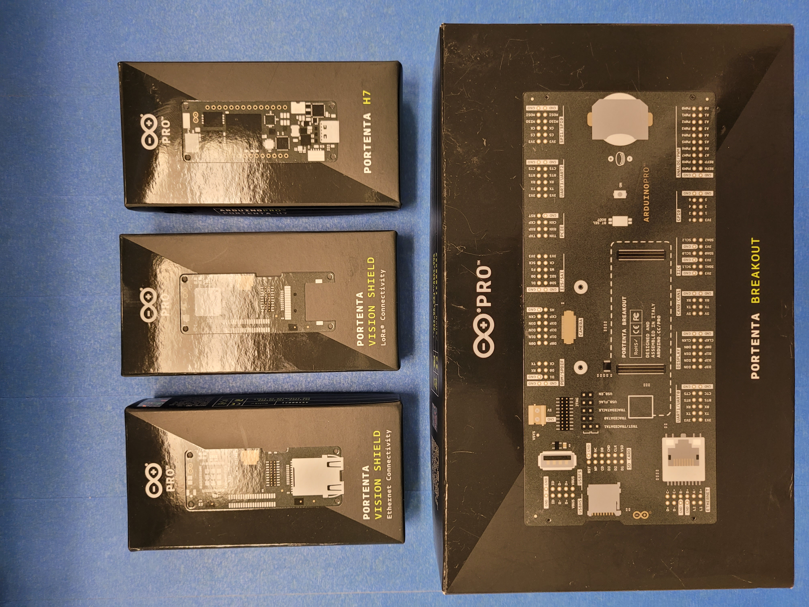 

Following are a few cheaper boards that could do parts of this course although the pins may be different. 

I also have a class set of 15 Seeeduino XIAO, for testing if a circuit is going to fry your board, you can't beat a $5 microcontroller. <br><br>

1. The $33.40 USD [Nano 33 Ble Sense](https://store.arduino.cc/usa/nano-33-ble-sense-with-headers) is very good for sound and accelerometer Machine Learning <br>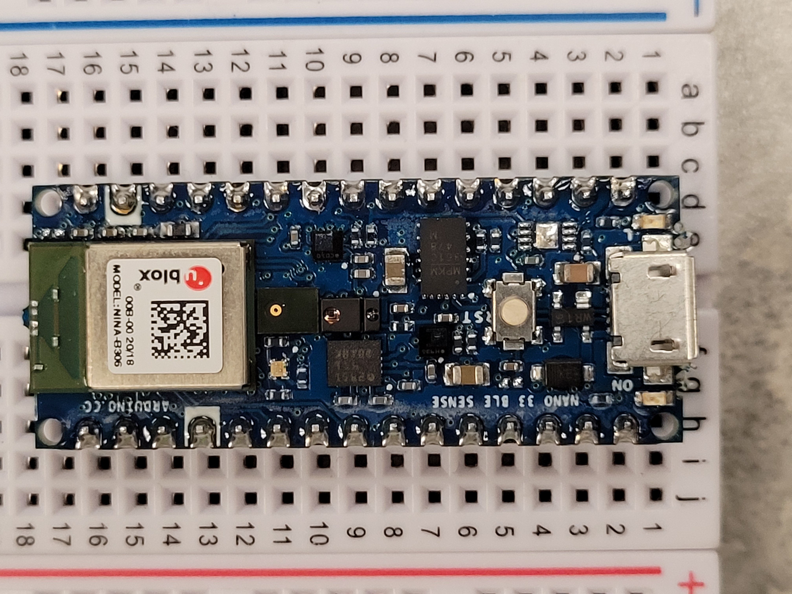<br><br>
3. The  $19.65 USD [Particle Photon](https://store.particle.io/products/photon) 6 year student tested Curriculum is [here](https://github.com/hpssjellis/particle.io-photon-high-school-robotics) with videos [here](https://www.youtube.com/playlist?list=PL57Dnr1H_egsL0r4RXPA4PY2yZhOJk5Nr). I still start my students on this very easy to use platform!<br>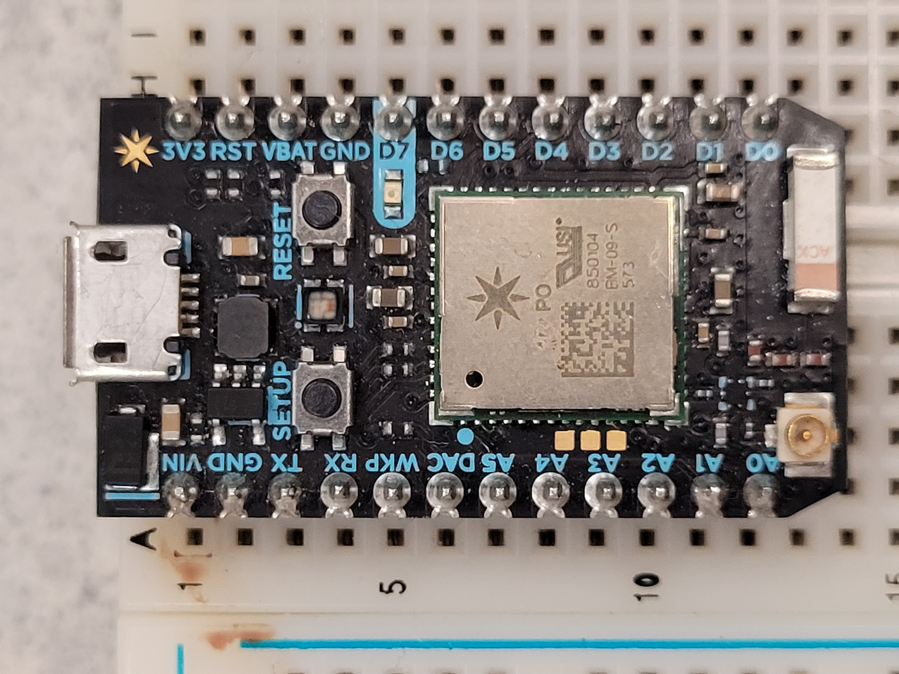<br><br>
4. The $5.40 USD [Seeeduino XIAO](https://www.seeedstudio.com/Seeeduino-XIAO-Arduino-Microcontroller-SAMD21-Cortex-M0+-p-4426.html)  Only a limited number of pins to use<br>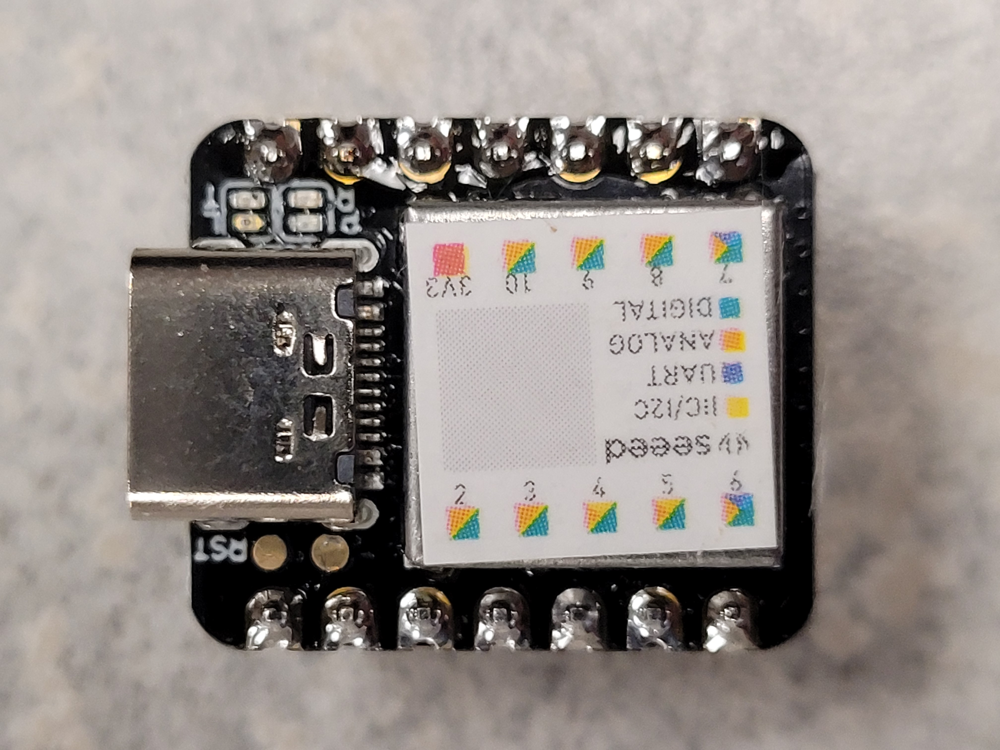<br><br>
5. The $129 USD [Sony Spresense Kit](https://shop.framos.com/us/spresense) with Breakout Board and Camera and now works on the Arduino IDE. Absolutely nothing wrong with this board, I have just not yet got it doing Machine Learning on the Arduino IDE yet. Note: uses LED0, LED1, LED2, LED4 instead of LEDB, LEDG, LEDR <br>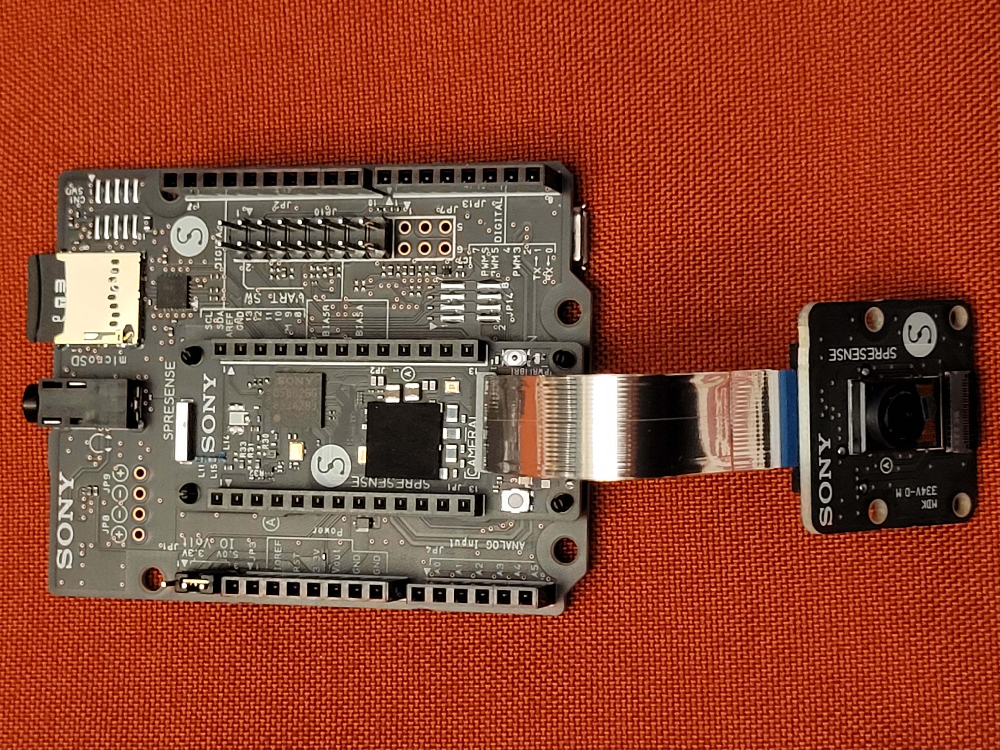<br><br>
6. The $25.50 USD [Arduino Nano-RP2040-Connect](https://store.arduino.cc/usa/nano-rp2040-connect-with-headers) Is very new but has lots of potential over the RPI Pico as it has WiFi and BLE onboard.<br> 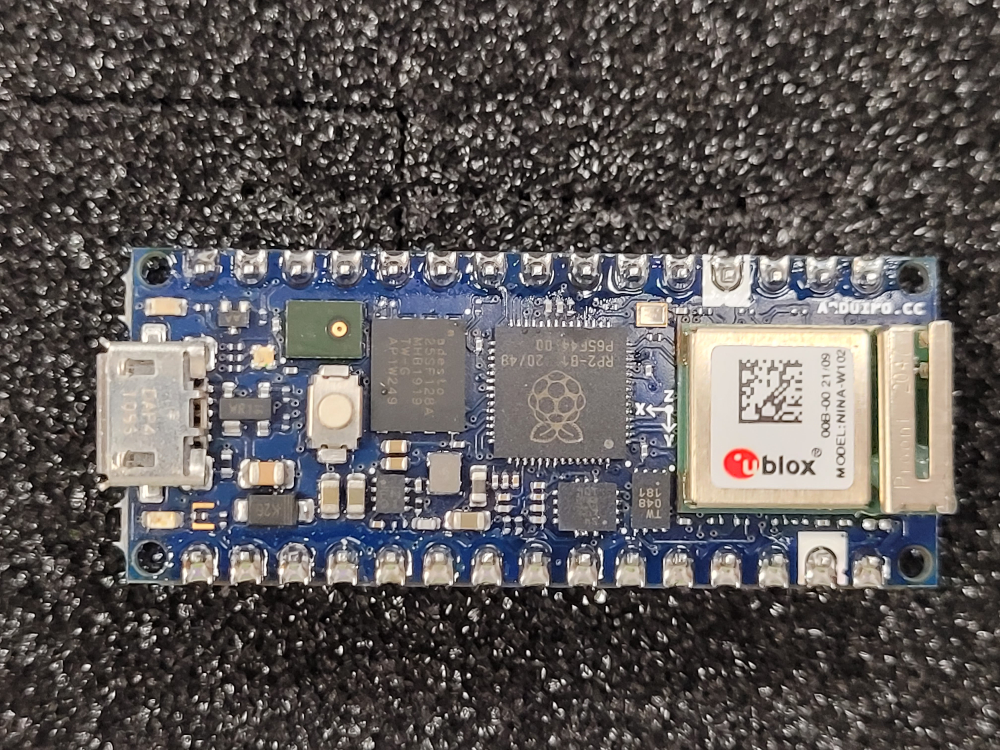<br><br><br>
7. The $4 USD [Raspberry Pi Pico](https://www.raspberrypi.org/products/raspberry-pi-pico/) Amazing board, see above. <br><br>
8. The $25.00 USD [ArducamPico-4ML](https://www.arducam.com/raspberry-pi-pico-machine-learning/) This board looks like it would be perfect for machine learning with a mini screen and camera but I have never got it properly working on the Arduino IDE.<br>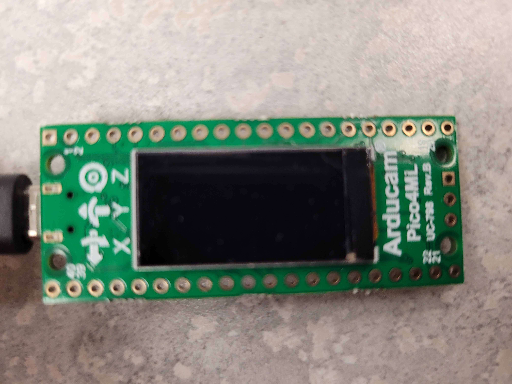 <br><br>


## Other Languages:
I use the [Arduino MBED core](https://github.com/arduino/ArduinoCore-mbed)   Arduino's on going attempt to simplify the MBED Arm programming OS, but there are other options:

1. [micro-Python](https://micropython.org/) The Portenta actually runs micro-python through the [OpenMV platform](https://openmv.io/) For Python lovers this is another. Note: Python is very fast to run, whereas Arduino code  (C++) must be compiled and can take a long time for each compile, theoretically the Arduino code is faster on the board.

2. [Circuit-Python](https://learn.adafruit.com/welcome-to-circuitpython) Another version of Python for micro-controllers by Adafruit which is a very maker friendly company. Does not support the Portenta but supports lots of other boards

4. [Javascript](https://www.rocksetta.com/tensorflowjs/beginner-examples/tfjs06-javascript.html): I have not really seen a Javascript language that looks any easier than C++ yet for a micro-controller. I am open to suggestions, there are lots of attempts. (For web pages, Javascript is awesome. Note: Websockets is a way for micro-controllers to interact with wewpages in realtime)

5. [Visuino](https://www.visuino.com/) A Visual programming drag and drop code creator for the Arduino may soon have Portenta compatibility, probably the future of Makers using micro-controllers as the actual coding is minimal 


## Post Understanding Activities: The Final Porject!

1. I have students try to stay away from final projects using Water or AC home 120/240 volts for obvious electrical safety precautions. I also have them stay away from drones as the commercial ones are very good and student testing their software with drones is too easy to smash your entire project.
2.  Individual Final Project with at least one sensor and one actuator
    1. Proof of Concept (POC) Sensor Actuator working
    2. Useful and/or fun
    3. Structure designed (3d Printed if needed)
    4. Final Project Prototype ready
    5. Can it be sold? If so how much. Is it worth it?
3. If time, final project with more sensors and actuators
4. If time, Group Project


## Course Notes:

1. Made for Makers not for future [Mechatronic Engineers](https://en.wikipedia.org/wiki/Mechatronics): Why? This course is to inspire Makers and future engineers, but to simplify the teaching I teach some things different than an Engineer would prefer. Few students I see have the: Drive, Ability and Finances to become Engineers. The students who could become an Engineer typically ignores me and get their assignments done really fast. Example: I code Javascript using Notepad.exe on windows, I don't even use Notepad++ a soon to be engineer might load a different editor like "[Atom](https://atom.io/)" and I am fine with that, I just don't want to waste my teaching time getting editors installed on school and student home computers, and then waste another 3 weeks teaching how to effectively use the editor.

Examples of things I do that drive Engineers crazy:

1. Itterators: say in a "for" loop. I use "myCount" (I put "my" before every funciton or variable we create, so students know not to google them), Software Engineer "i"
2. Engineers will make a pin variable say called ```pin12``` and assign it to a pin say 6. And then throughout the program refer to ```pin12```, which confuses average students. I just use ```D6``` throughout the code so students know that this is digital pin 6. If they have to change it they just search and replace, but that drives Engineers crazy.
3. Files: I put everything that does one thing into one file, Software Engineer: multiple files in multiple folders because they have the IQ to keep track of them.
4. I use Notepad as an editor, Engineer's typically would use anything but Notepad.
5. I don't comment anything that can be googled, as the more writing stresses students out I also use camelCase long names to describe variables. Engineers, should comment everything.
6. I try to get things working without a ton of theory, since interested students can lookup the theory. Engineers, theory first.
7. I really should use [fritzing diagrams](https://fritzing.org/) for all my videos, but I have students make their own diagrams in anyway they like, and then they use their own diagram to connect the circuit. I find they have then thought more about it. Also I prefer students to read the top of the sketch as the connection information is often there and no diagram is available.


By: Jeremy Ellis, Tech Teacher, BC, Canada

###### Use at your own risk!

My Github: [hpssjellis](https://github.com/hpssjellis?tab=repositories) , My twitter: [@rocksetta](https://twitter.com/rocksetta) , my Website [rocksetta.com](https://www.rocksetta.com/) My Arduino Forum [jerteach](https://forum.arduino.cc/u/jerteach/activity) my Edge Impulse Forum [rocksetta](https://forum.edgeimpulse.com/u/rocksetta/activity)

